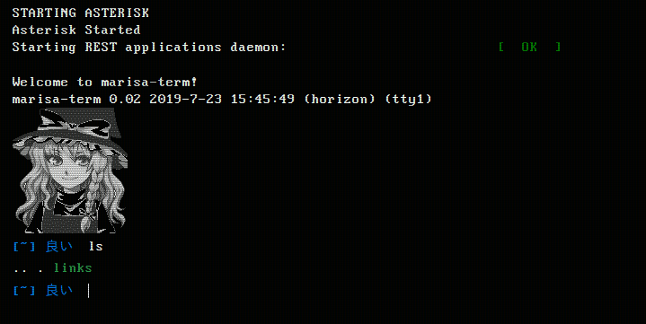

# marisa-term
development  
[live demo](https://tsunagari.space/term)

This is javascript based fake terminal emulator with Flask backend.  




## Structure  
`raw.js` - contains 'raw' text data and several variables to use in `term.js`.  
`term.js` - emulator itself. All functions are defined within its body. For everything that can't be done with javascript it makes a POST request to backend server.  

`module_config.py` - contains configurations for python modules like openweathermap.  
`processing.py` - is imported by `routes.py` later, contains actual service functions, e.g `getWeather` or `host`.  

`term.html` - emulator's body. It needs two divs to operate:  
```
      <div id="wrapper">
      <div id="screen">
```  
The rest of html elements is defined in `term.js`.  

```
marisa-term
├── css
│   ├── marisa.css
│   ├── marisa.gif
│   ├── raw.js
│   └── term.js
├── marisa.png
├── README.md
├── server
│   ├── app
│   │   ├── __init__.py
│   │   ├── module_config.py
│   │   ├── processing.py
│   │   └── routes.py
│   └── server.py
└── term.html
```  

## Detailed functions usage  
|  Commands                                                          |  Description                       |
|---                                                                 |---                                 |
| <kbd>ls</kbd>                                                      | list directories                   |
| <kbd>cd</kbd>                                                      | change directory                   |
| <kbd>cat</kbd>                                                     | looks for the reference to the String object (if there is any) in hierarchy array, then prints the said string.                      |
| <kbd>whoami</kbd>                                                  | prints who you are                 |
| <kbd>groups</kbd>                                                  | prints groups                      |
| <kbd>hostname</kbd>                                                | prints hostname                    |
| <kbd>hextorgb</kbd>                                                | converts hex code to rgb: `hextorgb #00000` -> `rgb(0, 0, 0)`          |
| <kbd>host</kbd>                                                    | returns ip of specified domain. Simulates linux `host` command from `dnsutils`.                 |
| <kbd>weather</kbd>                                                 | returns weather for specified city.|
| <kbd>encode</kbd>                                                  | encodes image red channel's Least Significant Bit and returns it. |
| <kbd>decode</kbd>                                                  | decodes image red channel's LSB and returns hidden message. |
| <kbd>help</kbd>                                                    | prints help. `help [command]` gives more detailed help about the command provided.                        |

## Requisites  
`python3 -m pip install --user flask pyowm Pillow`  

Install gunicorn:  
`sudo apt install gunicorn3`  

Run:  
`gunicorn3 -w 4 -b 0.0.0.0:8050 server:app`  
`-w` - workers;  
`-b` - bind to address:port  

## Creating apache2 reverse proxy for api requests  

Enable apache2 proxy modules:  
`sudo a2enmod proxy proxy_http proxy_balancer lbmethod_byrequests`  

Edit your main website config: add <Location /api> block to it.
```
<VirtualHost *:443>
...
    <Location "/api">
        ProxyPass http://0.0.0.0:8050/api
        ProxyPassReverse http://0.0.0.0:8050/api
    </Location>
...
</VirtualHost>
```  
Now all requests to yourwebsite/api will be forwarded to your Flask application.
